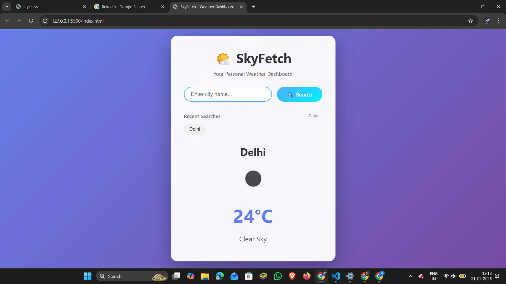

# 🌤 SkyFetch – Weather Dashboard

SkyFetch is a responsive weather dashboard built using **HTML, CSS, and JavaScript** that allows users to search for real-time weather information of any city worldwide.

---

## 🚀 Live Demo
🔗 [View Live Project](#)  
https://hanshika724-design.github.io/skyfetch-weather-dashboard/

---

## 📌 Features

- 🔍 Search weather by city name
- 🌡 Displays temperature, humidity, and wind speed
- 🌤 Shows weather condition icons
- ⚡ Real-time data fetched from Weather API
- 📱 Responsive design (mobile-friendly)
- ❌ Error handling for invalid city names

---

## 🛠 Tech Stack

- HTML5
- CSS3 (Flexbox/Grid)
- JavaScript (ES6)
- OpenWeatherMap API (or whichever API you used)

---

## 📷 Screenshots


---

## ⚙️ How to Run Locally

1. Clone the repository:
   ```bash
   git clone https://github.com/hanshika724-design/skyfetch-weather-dashboard.git
